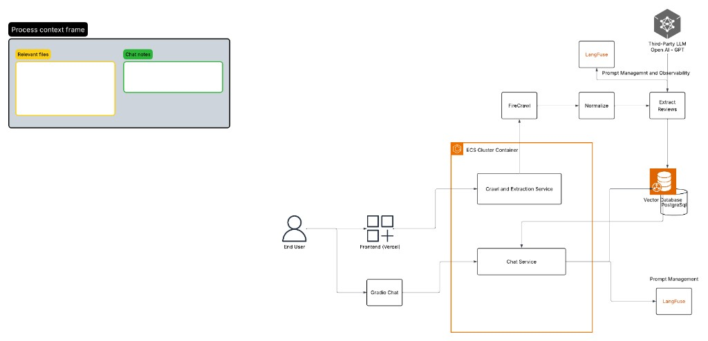
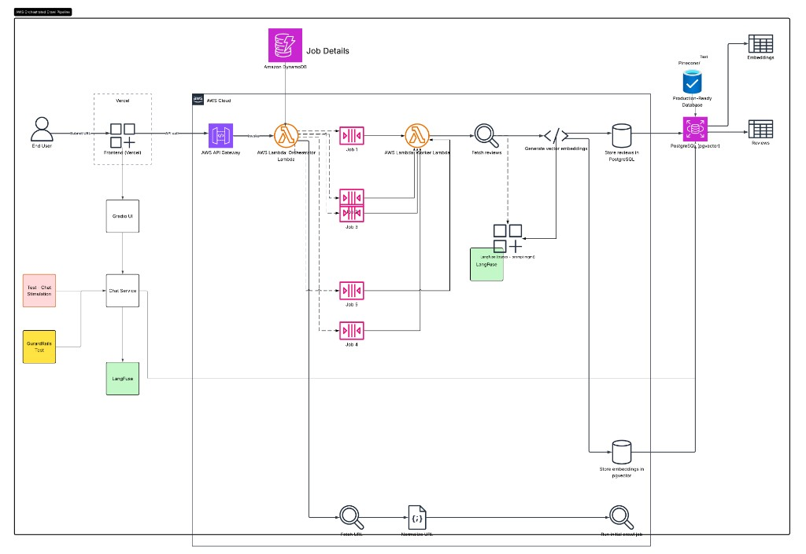

# Review Extractor

Fetch Capterra reviews from the SaaS products, extract structured data with OpenAI, store in PostgreSQL with embeddings. Can be adapted to any url (with normalization layer separate for each url).

| App | URL |
|-----|-----|
| **Extract reviews** | [product-reviews-ai-analysis (Vercel)](https://product-reviews-ai-analysis-oge4loufd-vidips-projects.vercel.app/) |
| **Chat** | [Review chat UI (ECS)](https://pr-efc9d4d66edc4544ace261e15c9f1d87.ecs.us-east-1.on.aws/) |

## Disclaimer — sample / development use only

This project is provided for **local experimentation, learning, and development** (e.g. testing Langfuse tracing, prompt design, or a review-analysis pipeline with sample data). It is **not intended for production or commercial use**.

Automated crawling or scraping of Capterra may **violate [Capterra’s Terms of Use](https://www.capterra.com/legal/terms-of-use/)** and related policies. Do not deploy this crawler to collect, republish, or monetize Capterra content at scale. Use official Capterra APIs, partnerships, or licensed data sources for any production or commercial product.

You are responsible for ensuring your use complies with applicable terms of service, robots.txt, and laws in your jurisdiction.

## Architecture

### Current architecture



End-to-end flow today: frontend or Gradio chat → ECS (crawl/extraction + chat services) → Firecrawl, OpenAI extraction, Langfuse, and PostgreSQL (pgvector).

### Ideal architecture



Target state: API Gateway → orchestrator/worker Lambdas → SQS job queues → fetch, embed, and store in PostgreSQL (pgvector) with optional Pinecone for vector search experiments.

## Setup

```bash
cd ~/Projects/capterra-review-extractor
python3 -m venv .venv
source .venv/bin/activate
pip install -e ".[dev]"
cp .env.example .env
# Add OPENAI_KEY and FIRECRAWL_API_KEY to .env
```

## Database

**Local (Docker):**

```bash
docker compose up -d
alembic upgrade head
```

**AWS RDS:** set `DATABASE_URL` in `.env` with `?sslmode=require` (see `.env.example`), then:

```bash
alembic upgrade head
```

## Run the API (synchronous crawl)

```bash
uvicorn src.api.main:app --reload --port 8000
```

```bash
curl -X POST http://localhost:8000/products \
  -H "Content-Type: application/json" \
  -d '{"url": "https://www.capterra.com/p/121248/When-I-Work/reviews/"}'
```

The API normalizes the URL (appends `/reviews/` when missing), creates the product, and crawls all pages in-process before returning.

Product URLs without `/reviews/` also work:

```bash
curl -X POST http://localhost:8000/products \
  -H "Content-Type: application/json" \
  -d '{"url": "https://www.capterra.com/p/121248/When-I-Work/"}'
```

## Run the Gradio Chat UI (streaming)

This chat UI retrieves similar reviews from PostgreSQL (pgvector) using OpenAI embeddings, then streams an answer.

```bash
docker compose up -d
alembic upgrade head
capterra-chat-ui
# or: python scripts/run_chat_ui.py
# Custom port: capterra-chat-ui --port 7861  (or GRADIO_PORT in .env)
```

**In Docker** (chat image from `Dockerfile.gradio`):

```bash
docker run --rm -p 7860:7860 --env-file .env your-chat-image
```

## Local crawl script

Same synchronous flow as the API:

```bash
python scripts/run_crawl_local.py "https://www.capterra.com/p/121248/When-I-Work/reviews/"
```

Crawls always walk pages newest-first. On each page, reviews are inserted in order until the first hash already in the database; then paging stops. A first-time product with no reviews crawls through all pagination pages; an existing product only picks up new reviews at the head.

### Mock fetch (current default)

The Firecrawl call in `src/extractor/fetch.py` is **commented out** for development. `fetch_page` returns fixed sample HTML (`_MOCK_FIRECRAWL_HTML`) with two fake reviews so you can test the rest of the pipeline (OpenAI extraction, embeddings, DB writes, Langfuse traces) without hitting Capterra or Firecrawl.

To restore live fetching: remove the mock return block in `fetch_page` and uncomment the Firecrawl logic below it. Sample HTML also lives in `fixtures/sample_reviews.html` if you want to reuse or extend it.

## ECS deployment

Two images: `Dockerfile` (API, port 8000) and `Dockerfile.gradio` (chat UI, port 7860).

- API: `./scripts/push-ecr.sh`
- Chat: `./scripts/push-ecr-gradio.sh`

Crawls run synchronously in the API request; size tasks/timeouts for multi-page products.

**Note:** The crawl path currently uses **mock HTML**, not live Firecrawl/Capterra requests (see [Mock fetch](#mock-fetch-current-default)). ECS is suitable for running the API and chat UI against data already in your database.

## Project layout

```
src/
  extractor/     # Firecrawl fetch, OpenAI parse, URL normalization
  db/            # SQLAlchemy models, repositories, migrations
  rag/           # Embedding generation
  crawl/         # Page processor + synchronous run_product_crawl
  api/           # FastAPI products endpoints
  chat/          # Gradio chat UI, retrieval, guardrails
  observability/ # Langfuse tracing + prompt management
scripts/
  run_crawl_local.py
  sync_langfuse_prompts.py
```

## Langfuse (tracing + prompt management)

[Langfuse](https://langfuse.com) is integrated for LLM observability and prompt management. It is **optional** — if Langfuse env vars are omitted, the app runs normally with local prompt fallbacks and a standard OpenAI client.

### What gets traced

During a product crawl, traces are nested like this:

```
product-crawl          (one sync run)
└── crawl-page         (one reviews page)
    ├── fetch-page     (Firecrawl / mock HTML)
    ├── OpenAI generation — extract reviews
    ├── OpenAI generation — detect pagination (page 1 only)
    └── OpenAI embeddings — new reviews
```

- **OpenAI calls** use the Langfuse drop-in client (`langfuse.openai`) so model name, tokens, latency, and cost are captured automatically.
- **Pipeline steps** use `@observe` spans with descriptive names (`product-crawl`, `crawl-page`, `fetch-page`).
- **Session grouping**: `session_id` is set to the sync run UUID so all pages in one crawl appear together in Langfuse Sessions.
- **Tags**: `capterra-crawl`, `crawl-page` for filtering in the UI.


### Configuration

**Region matters.** US keys must use `https://us.cloud.langfuse.com`; 

Restart the server after changing `.env` — Langfuse initializes a singleton client on first use.

### Prompt management

Prompts live in Langfuse under the **`production`** label. The app fetches them at runtime via `get_prompt(..., label="production")` and falls back to hardcoded templates in `src/observability/prompts.py` if Langfuse is disabled or a fetch fails.

| Prompt name | Used by | Variable |
|-------------|---------|----------|
| `capterra-extract-reviews` | Review extraction (`extract_reviews_with_openai`) | `{{page_content}}` |
| `capterra-extract-total-pages` | Pagination detection (`extract_total_pages_with_openai`) | `{{page_content}}` |
| `chat_app_system_prompt` | Gradio chat — main system prompt | — |
| `chat_grounding_rules` | Gradio chat — grounding / scope rules | — |
| `chat_Security_rules` | Gradio chat — security rules | — |
| `chat_greeting_system` | Gradio chat — greeting / small-talk handler | — |

**How it works in code:**

1. `compile_extract_*_prompt()` loads the prompt from Langfuse, substitutes `{{page_content}}`, and passes the prompt object to OpenAI as `langfuse_prompt` so generations link to the prompt name and version in traces.
2. `get_text_prompt()` / `get_chat_*()` load static chat prompts (no variables) for the Gradio UI.
3. Fallback strings in `prompts.py` keep the app working offline or when a prompt is missing.

**Upload prompts to Langfuse** (once per environment, or when prompt text changes):

```bash
python scripts/sync_langfuse_prompts.py
```

This creates a new version for each prompt and labels it `production`. Edit prompts in the Langfuse UI to iterate without redeploying; the SDK caches prompts for ~60 seconds.

## Tests

```bash
pytest
```

## Security

- Store API keys in `.env` (never commit)
- Cookie files contain session tokens — do not commit
